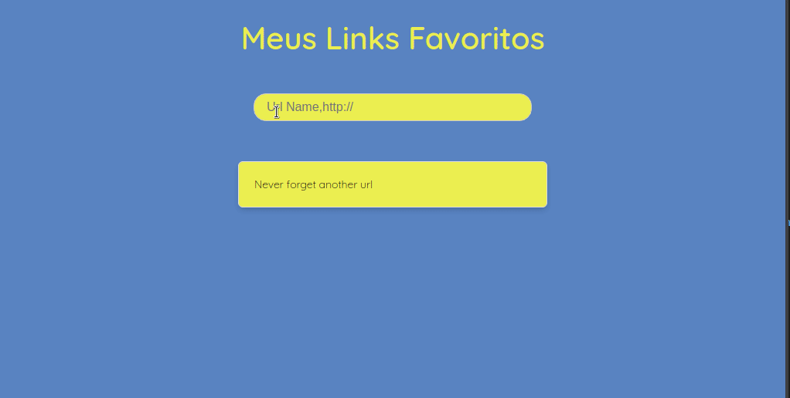

  

<h1 align='center'>Bookmark</h1> 

Armazenador de links ou apenas "favoritos"...bookmarks são muito úteis para guardar links com uso recorrente.  
Essa aplicação foi desenvolvida com HTML, CSS e JS, além do uso do NODE JS para guardar as URLs e fazer sua respectiva request via http quando clicada pelo usuário. A interatividade da página foi construída com JS puro.
